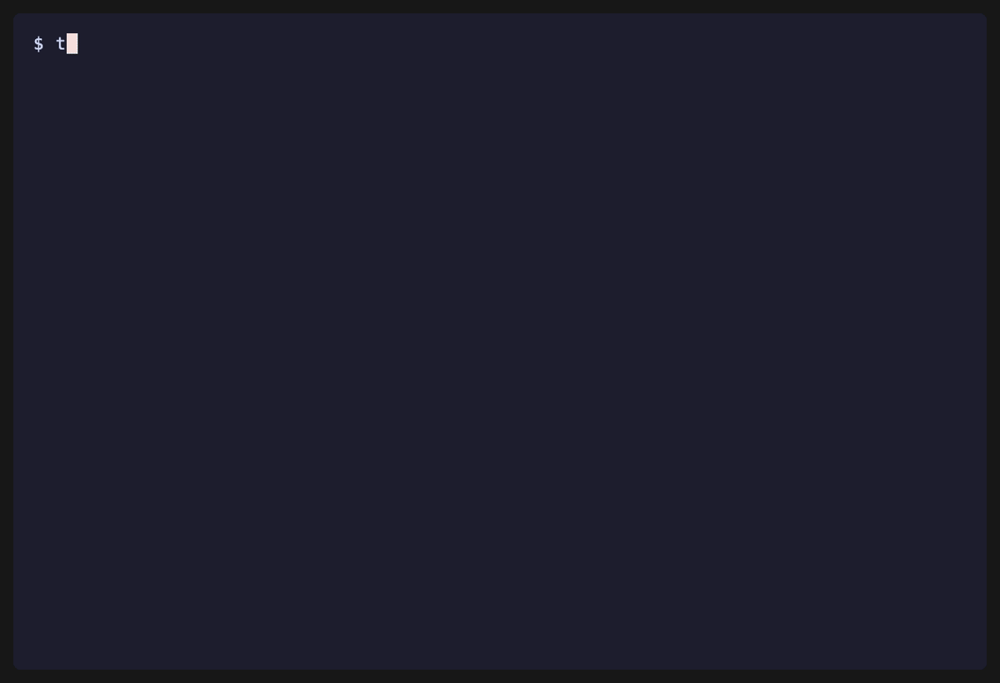

# Term Chameleon

Keep terminal text readable on translucent ("glass") terminals, automatically.

Glassy terminal themes look great until white text disappears over a bright browser
window behind them, dim text vanishes over a dark blur, or iTerm2's Light/Dark profile
variants silently override your palette. Term Chameleon diagnoses and fixes those
readability failures, and can watch your screen and adapt your terminal's colors and
transparency live as the background behind it changes. macOS + iTerm2 today; OSC color
sequences work on Kitty, Ghostty, and Alacritty too.



## Quickstart

```bash
pip install 'term-chameleon[iterm]'
term-chameleon setup --yes
```

`setup --yes` runs a permission-free self-check and installs the adaptive "Glass" profile
into iTerm2. Select that profile in iTerm2 and you have a tuned, readable glass terminal.

Want it to adapt automatically as your background changes? Install the watcher:

```bash
term-chameleon install-watch-daemon
```

Restart iTerm2. A single background `watch-live` process now samples your screen and
adjusts the terminal's colors and transparency to stay readable. Inspect it with
`watch-daemon-status`; remove it with `uninstall-watch-daemon`.

That is the whole path: two commands to a tuned profile, three for live auto-adaptation.
Everything below is for diagnosing, customizing, or scripting.

## What it does

- **Diagnose** a profile: `term-chameleon doctor <profile>.json` reports readability
  failures (low ANSI-black contrast, Light/Dark variant drift, transparency vs contrast)
  with WCAG ratios and concrete suggestions.
- **Fix** conservatively: `term-chameleon fix <profile>.json` previews and applies a
  readable palette, with a backup and explainable changes.
- **Apply a mode** to the current terminal over OSC: `term-chameleon osc apply dark-glass --write`
  (presets: `balanced`, `dark-glass`, `bright-safe`, `accessibility`, `high-variance-safe`,
  `presentation`). Works on iTerm2, Kitty, Ghostty, and Alacritty.
- **Adapt live**: `watch-live` samples the screen, classifies background-brightness risk
  with hysteresis, and applies the matching preset to the current iTerm2 session — reducing
  transparency when a bright background would wash out text, restoring it when the
  background is dark.

## How live adaptation works

`watch-live` samples the screen (or the iTerm window region) on an interval, estimates
background luminance, and runs a risk classifier: bright backgrounds raise washout risk,
dark backgrounds lower it. A hysteresis selector with a stable-sample count and a cooldown
decides when to switch modes, avoiding thrash on transient changes. On a switch it applies
the preset to the live iTerm2 session-local profile — adjusting foreground colors and
window transparency together — through the iTerm2 Python API.

## See it work

Quickest look — cycle the presets on your current terminal and watch the colors change:

```bash
term-chameleon demo
```

`demo` applies each preset to your live iTerm2 session in turn, pausing between each, so
you can watch the foreground colors and transparency shift. Run it from a visible iTerm2
window.

See the *automatic* adaptation — the terminal recoloring on its own, no typing — by
driving the real watch loop off a repeating bright/dark cycle:

```bash
term-chameleon watch-live --yes --demo-cycle --interval 2 --duration 30
```

The terminal switches modes by itself on a timer — this is the same sample → decide → apply
loop the installed daemon runs, only the daemon samples your real screen. To make the switch
obvious on an ordinary opaque window, `--demo-cycle` applies an exaggerated background per
mode (dark for dark backgrounds, near-white for bright ones); the real presets keep a subtle
dark background and adapt mainly through transparency, which only shows over a translucent
window. Record the iTerm2 window with Cmd-Shift-5 while it runs to capture the clip.

To see the full glass effect — colors adapting to a background *behind* a translucent
terminal:

1. In iTerm2, select the installed "Adaptive Glass" profile (translucent), or set your
   current profile's Transparency to about 30% with Blur on.
2. Put a browser or document window behind the terminal so it shows through.
3. Start the watcher and change what's behind the terminal:

   ```bash
   term-chameleon watch-live --yes --whole-screen --interval 2 --duration 120
   ```

   Switch the background between a bright white page and a dark one. The terminal's text
   and transparency adjust to stay readable, and each decision prints as it happens.

To capture a shareable clip, record that session with QuickTime (or Cmd-Shift-5). macOS
only lets a screen recording capture the visible space, so recording is the reliable way
to produce a demo image or GIF — the `demo` command intentionally does not screenshot for
you (it would capture whatever else is on screen).

## Requirements

- macOS with iTerm2 (for live adaptation and profile install)
- Python 3.11+
- The `iterm2` Python package for live features: `pip install 'term-chameleon[iterm]'`

OSC color application (`osc apply`) needs none of the above and works on any supporting
terminal.

## CLI examples

Run a permission-free deterministic self-check after installation or inspect local readiness:

```bash
term-chameleon check --output-dir artifacts/check
term-chameleon release-check --output-dir artifacts/release-check
term-chameleon setup
term-chameleon setup --yes
term-chameleon setup --live
term-chameleon config-example --output ~/.config/term-chameleon/config.toml
term-chameleon config-check --config ~/.config/term-chameleon/config.toml
term-chameleon watch-live --config ~/.config/term-chameleon/config.toml --dry-run
term-chameleon status
term-chameleon status --live
term-chameleon status --json
```

`setup` is a guided flow: it runs deterministic checks and reports status. On first run, bare `setup` exits nonzero until a healthy profile exists; use `setup --yes` to install the generated profile, and `setup --live` to include live iTerm2 API/window readiness.

`release-check` is the top-level local gate. By default it is permission-free and writes JSON/Markdown reports; add `--config`, `--live`, `--daemon`, or `--live-stage` to include config validation, live iTerm2 probes, AutoLaunch health, or controlled Safari+iTerm2 screenshot QA.

`config-example` prints a commented TOML file. `config-check` validates value types, preset names, region shape, and unknown sections/keys. `watch-live`, `install-watch-daemon`, and `setup` accept `--config`; explicit CLI flags override config values.

Install a balanced preset into a target directory:

```bash
term-chameleon install --target-dir /tmp/iterm-dynamic-profiles --name "Adaptive Glass"
```

Install an iTerm2 AutoLaunch script that starts the live watcher whenever iTerm2 launches:

```bash
term-chameleon install-watch-daemon --dry-run
term-chameleon watch-daemon-status
term-chameleon install-watch-daemon
term-chameleon watch-daemon-status --json
term-chameleon uninstall-watch-daemon --dry-run
term-chameleon uninstall-watch-daemon
```

`uninstall-watch-daemon` removes the iTerm2 AutoLaunch script only; it does not stop an already-running watcher process or remove logs/pid files. It creates a backup by default unless `--no-backup` is passed.

Apply a manual readability mode to a profile JSON file:

```bash
term-chameleon mode bright-safe ~/Library/Application\ Support/iTerm2/DynamicProfiles/adaptive-glass.json --dry-run
```

Check iTerm2 Python API readiness and generate a conservative session-local adapter script:

```bash
term-chameleon iterm-api-check
term-chameleon iterm-connect-probe
term-chameleon iterm-window-bounds
term-chameleon iterm-live-script --preset balanced --output /tmp/term-chameleon-live.py
```

Probe macOS screenshot availability and generate controlled screenshot-test artifacts:

```bash
term-chameleon screenshot-probe
term-chameleon screenshot-probe --capture --output artifacts/screenshot-probe/screen.png
term-chameleon screenshot-contrast artifacts/screenshot-probe/screen.png --output-dir artifacts/screenshot-contrast
term-chameleon screenshot-text-contrast artifacts/screenshot-probe/screen.png --output-dir artifacts/screenshot-text-contrast
term-chameleon screenshot-test --output-dir artifacts/screenshot-test
term-chameleon screenshot-test --capture --output-dir artifacts/screenshot-test
term-chameleon background-html --output-dir artifacts/background-html
term-chameleon pattern-script --output-dir artifacts/pattern-script
term-chameleon e2e-stage tests/fixtures/iterm/good-dark-glass.json --output-dir artifacts/e2e-stage
term-chameleon live-stage --dry-run --output-dir artifacts/live-stage
term-chameleon live-stage --yes --capture --output-dir artifacts/live-stage
```

`live-stage --yes` is intentionally explicit because it activates Safari, opens the controlled background page, creates/resizes an iTerm2 window, writes the ANSI pattern command into that session, and may require macOS Automation/Accessibility/Screen Recording permissions. It leaves the staged windows open for inspection.

```bash
term-chameleon sample --screen --output artifacts/adapt/screen.png
term-chameleon sample --screen --iterm-window --output artifacts/adapt/iterm-window.png
term-chameleon sample --screen --region 0,0,800,600 --output artifacts/adapt/region.png
term-chameleon adapt-once tests/fixtures/iterm/good-dark-glass.json --screen --dry-run
term-chameleon watch-live --dry-run --duration 10 --interval 1 --stable 2
term-chameleon watch-live --dry-run --iterm-window --duration 10 --interval 1 --stable 2
term-chameleon watch-live --yes --iterm-window --duration 30 --interval 2 --stable 3 --cooldown 10
```

Manual live smoke test, once iTerm2 is running and the Python API is enabled:

```bash
scripts/live-iterm-smoke.sh
```

Detect the current terminal and apply OSC color sequences for cross-terminal support (iTerm2, Kitty, Ghostty, Alacritty):

```bash
term-chameleon terminal-info
term-chameleon terminal-info --json
term-chameleon osc apply balanced
term-chameleon osc apply balanced --write
term-chameleon osc apply balanced --tmux
term-chameleon osc apply balanced --shell
term-chameleon osc reset
```

`osc apply <preset> --write` writes raw OSC 10/11/4 escape sequences directly to stdout for any OSC-capable terminal. Use `--tmux` inside a tmux session or `--shell` to get a printf-safe command. `terminal-info` reports the detected terminal type and capability flags.

Run the mode risk-classifier and hysteresis simulator:

```bash
term-chameleon watch-sim 0.2 0.8 0.5
term-chameleon watch-sim --stable 2 0.2 0.2 0.8 0.8
```

Run deterministic visual simulation:

```bash
term-chameleon visual-test tests/fixtures/iterm/good-dark-glass.json
```

Doctor a profile:

```bash
term-chameleon doctor tests/fixtures/iterm/bad-light-variant.json
term-chameleon doctor tests/fixtures/iterm/bad-light-variant.json --json
```

`doctor --json` emits machine-readable diagnostics after a profile loads successfully; profile load/parse errors still use the standard nonzero exit code with an error on stderr.

Preview fixes:

```bash
term-chameleon fix tests/fixtures/iterm/bad-light-variant.json --dry-run
```

Apply fixes to a copy:

```bash
cp tests/fixtures/iterm/bad-light-variant.json /tmp/profile.json
term-chameleon fix /tmp/profile.json --yes
term-chameleon doctor /tmp/profile.json
```

## Troubleshooting

**iTerm2 Python API not connected:**

Ensure iTerm2 is running and Python API support is enabled: iTerm2 → Settings → General → Magic → check "Enable Python API". Run `term-chameleon iterm-api-check` to verify.

**Screen Recording permission denied:**

macOS requires Screen Recording permission for `screencapture`. Grant it in System Settings → Privacy & Security → Screen Recording for the terminal running Term Chameleon.

**AutoLaunch daemon not starting:**

Verify the script exists and is executable:

```bash
term-chameleon watch-daemon-status
```

If the PID file is stale (process not running), remove it and restart iTerm2:

```bash
rm ~/Library/Application\ Support/term-chameleon/watch-live.pid
```

**Stale watcher process after uninstall:**

`uninstall-watch-daemon` removes the AutoLaunch script but does not kill a running watcher. Stop it manually:

```bash
kill "$(cat ~/Library/Application\ Support/term-chameleon/watch-live.pid)"
```

**Daemon CPU or disk usage:**

The daemon defaults to a 10-second sampling interval and prunes artifacts to the 200 most recent. To reduce overhead further, increase the interval via config or `--interval`.

**iTerm2 window bounds unavailable on startup:**

The daemon defaults to whole-screen sampling for startup robustness. If using `--iterm-window`, the watcher waits up to 60 seconds for iTerm2 to create a window before failing.

## Development

```bash
uv sync --extra dev
uv run pytest
uv run ruff check .
```

If you do not use `uv`:

```bash
python3 -m pytest
python3 -m term_chameleon.cli doctor tests/fixtures/iterm/bad-light-variant.json
```

## Safety principles

- Static analysis before mutation.
- `--dry-run` support for fixes.
- Timestamped backups before writing.
- Deterministic JSON output.
- Explainable diagnostics and fixes.
- No direct mutation of `~/Library/Preferences/com.googlecode.iterm2.plist` as the primary mechanism.

## Positioning

Term Chameleon is not just another terminal theme and does not claim to invent automatic contrast. Prior art includes iTerm2 Minimum Contrast, Apple Terminal contrast tweaking, Ghostty minimum contrast, terminal opacity/blur settings, CSS blend-mode/backdrop approaches, and WCAG/APCA contrast engines.

The intended differentiated direction is a live contrast controller for translucent terminal windows: sample or infer the actual visual environment behind the terminal, then adapt palette, opacity, blur, and contrast to keep text readable without giving up the glass effect.
